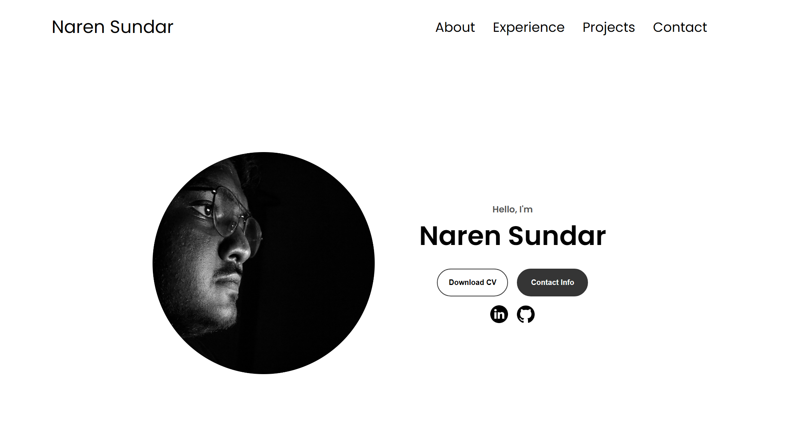

# Portfolio Website 🌐

Welcome to the repository for my **personal portfolio website**! This project showcases my skills, projects, and contact information in a clean and interactive design.

 <!-- Add a screenshot of your portfolio -->

---

## 🚀 Features

- **Responsive Design**: Optimized for desktop and mobile devices.
- **Interactive Elements**: Smooth animations and transitions.
- **Dynamic Content**:
  - Typewriter effect for roles.
  - Blob animation that follows the cursor.
- **Projects Section**: Displays recent projects with live demo and GitHub links.
- **Contact Section**: Provides links to my social profiles and email.

---

## 🛠️ Technologies Used

- **HTML5**
- **CSS3**
  - Flexbox
  - Media Queries
  - Animations
- **JavaScript**
  - Mouse tracking for interactive elements.
  - Typewriter effect for dynamic text.
- **GitHub Pages** (for deployment)

---

## 📂 Folder Structure

```plaintext
├── index.html          # Main HTML file
├── style.css           # Styling for the website
├── mediaqueries.css    # Additional responsive design rules
├── script.js           # Interactive JavaScript features
├── assets/             # Images, icons, and other assets
